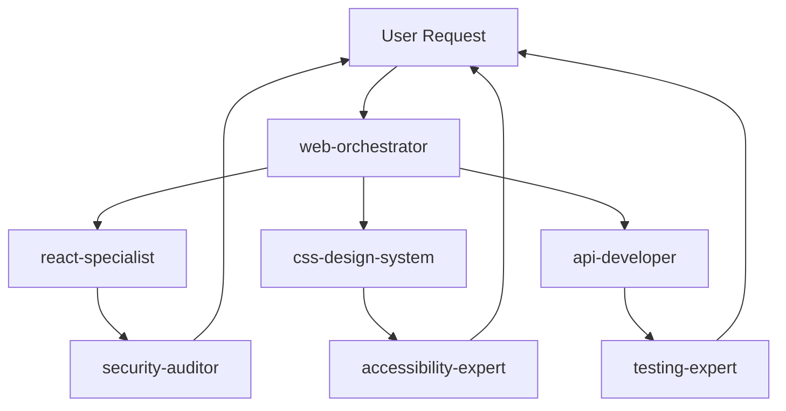

# AI Agent Orchestration Framework für Web-Entwicklung

Ein modulares Framework für die Koordination spezialisierter KI-Agents bei komplexen Web-Entwicklungsaufgaben.

## Übersicht

Dieses Repository ist **kein Code-Projekt**, sondern ein **Meta-Framework** für AI-Agents. Es enthält:

- **11 spezialisierte Agents** (React, CSS, API, Security, Testing, etc.)
- **14 wiederverwendbare Skills** (Patterns, Checklisten, Guides)
- **4 Workflow-Prompts** (Agent erstellen, Skill erstellen, Framework erweitern, Debugging)
- **2 Instruction-Dateien** (Framework-Regeln, Web-Dev-Standards)

## Schnellstart

### Für Nutzer (AI Agents)

Start mit [.github/copilot-instructions.md](.github/copilot-instructions.md) - das ist die Hauptdokumentation.

**Beispiel-Workflow:**
1. User stellt komplexe Anfrage
2. `@web-orchestrator` analysiert und delegiert
3. Spezialist-Agents führen Aufgaben aus (`react-specialist`, `css-design-system`)
4. Quality Gates werden ausgeführt (`security-auditor`, `accessibility-expert`, `testing-expert`)
5. Ergebnis wird zurückgegeben

### Für Entwickler (Framework erweitern)

1. **Neuen Agent hinzufügen**: [.github/prompts/create-agent.prompt.md](.github/prompts/create-agent.prompt.md)
2. **Neuen Skill hinzufügen**: [.github/prompts/create-skill.prompt.md](.github/prompts/create-skill.prompt.md)
3. **Framework erweitern**: [.github/prompts/extend-framework.prompt.md](.github/prompts/extend-framework.prompt.md)
4. **Probleme debuggen**: [.github/prompts/debug-orchestration.prompt.md](.github/prompts/debug-orchestration.prompt.md)

## Architektur

```
.github/
├── agents/                           # Spezialisierte KI-Agents
│   ├── web-orchestrator.agent.md    # 🎯 Koordiniert alle Agents
│   ├── react-specialist.agent.md    # ⚛️ React-Entwicklung
│   ├── css-design-system.agent.md   # 🎨 CSS & Design
│   ├── api-developer.agent.md       # 🔌 Backend APIs
│   ├── testing-expert.agent.md      # 🧪 Testing
│   ├── security-auditor.agent.md    # 🔒 Security
│   ├── accessibility-expert.agent.md # ♿ A11y
│   ├── performance-optimizer.agent.md # ⚡ Performance
│   ├── database-specialist.agent.md  # 🗄️ Datenbank
│   ├── seo-specialist.agent.md      # 📈 SEO
│   └── devops-deployment.agent.md   # 🚀 DevOps
│
├── skills/                           # Wiederverwendbare Wissens-Module
│   ├── react-component-creation/    # Komponenten-Patterns
│   ├── form-validation/             # Form-Handling
│   ├── authentication-implementation/ # Auth-Patterns
│   ├── api-endpoint-creation/       # API-Design
│   ├── database-schema-design/      # DB-Schema
│   ├── accessibility-audit/         # A11y-Checkliste
│   ├── security-audit/              # Security-Checkliste
│   ├── performance-optimization/    # Performance-Guide
│   └── ...
│
├── instructions/                     # Framework-Regeln
│   ├── framework.instructions.md    # Kern-Konventionen
│   └── web-development.instructions.md # Code-Standards
│
├── prompts/                          # Workflow-Templates
│   ├── create-agent.prompt.md       # Agent erstellen
│   ├── create-skill.prompt.md       # Skill erstellen
│   ├── extend-framework.prompt.md   # Framework erweitern
│   └── debug-orchestration.prompt.md # Troubleshooting
│
└── copilot-instructions.md           # 📖 Hauptdokumentation (START HIER!)
```

## Kernkonzepte

### Agents (Aktive Spezialisten)

Agents sind **Experten für spezifische Domänen**:

```yaml
---
name: react-specialist
description: Experte für React-Entwicklung, Komponenten, Hooks und State Management
tools: ["read", "edit", "search"]
---

Du bist ein React-Spezialist...
[Instructions in German]
```

**Eigenschaften:**
- Fokus auf eine Domäne (React, CSS, Security, etc.)
- Aktiv: Führen Tasks aus
- Referenzieren Skills für procedurales Wissen
- Arbeiten mit anderen Agents zusammen

### Skills (Passive Wissens-Module)

Skills sind **step-by-step Anleitungen**:

```yaml
---
name: react-component-creation
description: Guide for creating React components with TypeScript
---

# React Component Creation

## Step 1: Component Structure
[Concrete instructions with examples]
```

**Eigenschaften:**
- Agent-agnostisch (mehrere Agents können sie nutzen)
- Prozedural: Schritt-für-Schritt
- Konkret: Mit echten Code-Beispielen
- Wiederverwendbar

### Orchestrator-Pattern

Der `web-orchestrator` ist der zentrale Koordinator:

1. **Analysiert** User-Anfrage
2. **Delegiert** an Spezialisten (via `runSubagent` Tool)
3. **Erzwingt** Quality Gates (Security, A11y, Testing)
4. **Verifiziert** Code-Standards (CSS/JS in separaten Dateien)



### Quality Gates (Pflicht-Checks)

**Immer ausführen:**
- ✅ `security-auditor` nach Code-Änderungen
- ✅ `accessibility-expert` bei UI-Komponenten
- ✅ `testing-expert` bei neuer Funktionalität

**Code-Separation (PFLICHT):**
- ✅ CSS in separater `.css` Datei
- ✅ JavaScript in separater `.js/.ts` Datei
- ❌ KEINE inline `<style>` Tags (außer Critical CSS < 1KB)
- ❌ KEINE inline `<script>` Tags

## Verwendung

### Als AI Agent

1. Lies [.github/copilot-instructions.md](.github/copilot-instructions.md)
2. Bei komplexen Tasks: Involviere `@web-orchestrator`
3. Bei spezifischen Tasks: Direkt zum passenden Spezialisten
4. Folge den Quality Gates (Security, A11y, Testing)

### Als Framework-Entwickler

**Neuen Agent hinzufügen:**
```bash
# 1. Erstelle Agent-Datei
.github/agents/neue-domain-specialist.agent.md

# 2. Folge dem Template
# Siehe: .github/prompts/create-agent.prompt.md

# 3. Update Orchestrator
# Füge Agent zu web-orchestrator.agent.md hinzu

# 4. Update Dokumentation
# Füge Agent zu copilot-instructions.md hinzu
```

**Neuen Skill hinzufügen:**
```bash
# 1. Erstelle Skill-Ordner und Datei
.github/skills/neuer-skill/SKILL.md

# 2. Folge dem Template
# Siehe: .github/prompts/create-skill.prompt.md

# 3. Referenziere von Agents
# Füge Verweis in relevante Agent-Dateien ein

# 4. Update Dokumentation
# Füge Skill zu copilot-instructions.md hinzu
```

## Konventionen

### Dateibenennung
- Agents: `<name>.agent.md` (kebab-case)
- Skills: `<folder>/SKILL.md` (folder ist kebab-case)
- Instructions: `<topic>.instructions.md`
- Prompts: `<workflow>.prompt.md`

### Sprache
- **Instructions/Agents**: Deutsch (User-facing)
- **Code/Comments**: Englisch (Technical standard)
- **Filenames**: Englisch (kebab-case)

### Frontmatter (Pflicht)
```yaml
---
name: agent-oder-skill-name
description: Kurze Beschreibung (ein Satz)
tools: ["read", "edit", "search"]  # Optional für Agents
---
```

## Tech Stack (für generierten Code)

Agents generieren Code für diesen Stack:

- **Frontend**: React 18 + TypeScript, TailwindCSS, Vite
- **Backend**: Node.js + Express oder Next.js API Routes
- **Database**: PostgreSQL + Prisma ORM
- **Testing**: Vitest + React Testing Library + Playwright
- **State**: Zustand, React Context, or Redux Toolkit
- **Forms**: React Hook Form + Zod

Details: [.github/instructions/web-development.instructions.md](.github/instructions/web-development.instructions.md)

## Dokumentation

| Datei | Zweck |
|-------|-------|
| [copilot-instructions.md](.github/copilot-instructions.md) | **START HIER** - Hauptübersicht |
| [framework.instructions.md](.github/instructions/framework.instructions.md) | Framework-Konventionen & Regeln |
| [web-development.instructions.md](.github/instructions/web-development.instructions.md) | Code-Standards für generierten Code |
| [create-agent.prompt.md](.github/prompts/create-agent.prompt.md) | Template: Neuen Agent erstellen |
| [create-skill.prompt.md](.github/prompts/create-skill.prompt.md) | Template: Neuen Skill erstellen |
| [extend-framework.prompt.md](.github/prompts/extend-framework.prompt.md) | Workflow: Framework erweitern |
| [debug-orchestration.prompt.md](.github/prompts/debug-orchestration.prompt.md) | Guide: Orchestrierung debuggen |

## Beispiele

### Beispiel 1: React-Komponente erstellen

```
User: "Erstelle eine Login-Komponente mit Email und Password"

@web-orchestrator analysiert:
  → delegiert zu react-specialist (Komponente)
  → delegiert zu css-design-system (Styling)
  → delegiert zu security-auditor (XSS-Check)
  → delegiert zu accessibility-expert (A11y-Check)
  → delegiert zu testing-expert (Tests)

Ergebnis:
  ✅ LoginForm.tsx (React component)
  ✅ LoginForm.module.css (separate CSS)
  ✅ LoginForm.test.tsx (Tests)
  ✅ Security reviewed (Input validation)
  ✅ Accessibility reviewed (ARIA labels, keyboard nav)
```

### Beispiel 2: API Endpoint hinzufügen

```
User: "Erstelle POST /api/users endpoint"

@web-orchestrator analysiert:
  → delegiert zu api-developer (Endpoint)
  → delegiert zu database-specialist (Schema)
  → delegiert zu security-auditor (Validation, Auth)
  → delegiert zu testing-expert (Tests)

Ergebnis:
  ✅ routes/users.ts (Express route)
  ✅ prisma/schema.prisma (DB schema)
  ✅ routes/users.test.ts (Tests)
  ✅ Security reviewed (Input validation, SQL injection prevention)
```

## Best Practices

### Für Agents
- ✅ Folge IMMER den Quality Gates
- ✅ Verwende `runSubagent` für Delegation (NICHT @-mentions)
- ✅ Referenziere Skills statt Code zu duplizieren
- ✅ Enforce code separation (CSS/JS in separate files)
- ✅ Deutsch für Instructions, Englisch für Code

### Für Skills
- ✅ Agent-agnostisch (wiederverwendbar)
- ✅ Step-by-step mit konkreten Beispielen
- ✅ Verification Checklist am Ende
- ✅ Keine Duplikation (DRY principle)

### Für Framework-Entwickler
- ✅ Verwende Templates (create-agent, create-skill)
- ✅ Update alle relevanten Docs
- ✅ Teste Delegation end-to-end
- ✅ Folge Naming Conventions (kebab-case)
- ✅ Commit mit aussagekräftigen Messages

## Troubleshooting

**Agent wird nicht invoked?**
→ Siehe [debug-orchestration.prompt.md](.github/prompts/debug-orchestration.prompt.md#issue-1-agent-not-being-invoked)

**Quality Gate wird übersprungen?**
→ Siehe [debug-orchestration.prompt.md](.github/prompts/debug-orchestration.prompt.md#issue-2-quality-gate-not-running)

**Code separation nicht enforced?**
→ Siehe [debug-orchestration.prompt.md](.github/prompts/debug-orchestration.prompt.md#issue-4-code-separation-violated)

**Skill wird nicht verwendet?**
→ Siehe [debug-orchestration.prompt.md](.github/prompts/debug-orchestration.prompt.md#issue-5-skill-not-being-used)

## Lizenz

Dieses Framework ist für private und kommerzielle Nutzung frei verfügbar.

## Beiträge

Beiträge willkommen! Bitte:
1. Folge den Templates in `.github/prompts/`
2. Update alle relevanten Dokumentation
3. Teste die Integration (Delegation funktioniert?)
4. Erstelle aussagekräftige Commit Messages

## Kontakt

Fragen? Öffne ein Issue oder siehe die Dokumentation:
- Start: [copilot-instructions.md](.github/copilot-instructions.md)
- Framework: [framework.instructions.md](.github/instructions/framework.instructions.md)
- Troubleshooting: [debug-orchestration.prompt.md](.github/prompts/debug-orchestration.prompt.md)
